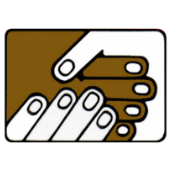

# Indigenous Bridge Application
## Description
Indigenous-Bridge is an iOS app designed and developed for indigenous people who move or live in North Bay to seek various services and connections. The app is developed by hyperdev team at Algonquin College for NBIFC client.




## Status: Testing phrase
## 1. Technologies Used/ Tested
- [x] React Native and xcode framework
- [x] React native Components.
- [x] State Management & Hooks
- [x] Tab & Nested Navigation
- [x] React native Styling and layout.
- [x] Map services
- [x] Side Navigation bar
- [x] React Context.
- [x] Vector Icons

## 2. Core features version 1:
- [x] User authetication: sign up, sign in, log out.
- [x] Discussion board: create, reply a discussion, sorting dicussions.
- [x] Browse information of events, news, surveys services and organizations.
- [x] Map view for organization.
- [x] Ask question: chat with admin.
- [x] App error handler.
- [x] AWS - S3 storage: upload image to S3.
- [x] Refresh screen to get new data.
- [x] Remember first login.
- [x] Web view in item detail.
- [x] Image Attachment posting discussion.


## 3. Desirable features version 1:
- [x] Search App level: search for items of events, jobs, services, news and organizations.
- [ ] Notification: replies dicussion.
- [x] Change user avatar.
- [ ] Chip filtering
- [ ] Video Attachment.
- [ ] Change font size
- [ ] Edit user profile.
- [ ] Saved items.
- [x] Remember first login.
- [ ] Organization rating.
- [ ] Forgot password.
- [ ] Serve server thru HTTPS

## 4. Setting up the development environment:
##### Xcode & CocoaPods
Xcode 12.4 [App Store]().

Install an iOS Simulator in Xcode

Install cocoapods 
```
sudo gem install cocoapods
```
##### Node & Watchman
We recommend installing Node and Watchman using Homebrew. Run the following commands in a Terminal after installing Homebrew:
```
brew install node
brew install watchman
```
If you have already installed Node on your system, make sure it is Node 10 or newer.

[Documentation](https://reactnative.dev/docs/environment-setup)

## 5. Steps to Run:
1. Clone the repo
```
git clone [repoLink]
```
2. Change directory to project folder
```
cd [projectDirectory]
```
3. Switch to dev branch
```
git checkout dev
```
4. Install dependencies
```
npm install
```
5. Install podfile
```
cd ios & pod install
```
6. Start Metro
```
npx react-native start
```
7. Start your application in simulator by default
```
npx react-native run-ios
```
8. Run application in a physical device
```
 - Open project workspace in ios folder by xcode.
 - Connect your device to computer by using cable.
 - Choose your project and device to run.
 - Click Play button to build and run the app in your device.
```
{ width=100, height=200 }

## 6. Testing and Fix bugs:

HyperDev has run the phrase 1 of testing the application. We create a list of bugs in [here](https://docs.google.com/spreadsheets/d/1d0rzOqYTUg8lmaQJNggO1QVCdsouy4Kd5lyFv1D2ack/edit#gid=0). Next, we will fix verified bugs and do the phrase 2 of testing.
